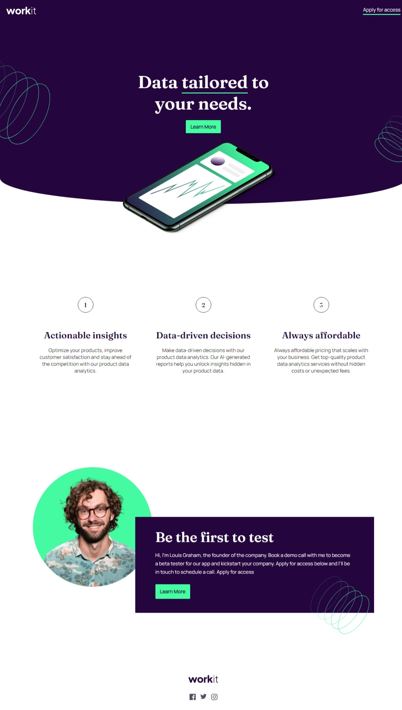

# Workit Landing Page

the Workit Landing Page effectively combines visually appealing design elements with clear messaging to attract users and encourage them to learn more about the Workit app. The typewriter effect could be applied to specific sections to add a dynamic and engaging element to the page.

## Table of contents

- [Overview](#overview)
  - [Screenshot](#screenshot)
  - [Links](#links)
- [My process](#my-process)
  - [Built with](#built-with)
  - [What I learned](#what-i-learned)
  - [Continued development](#continued-development)
  - [Useful resources](#useful-resources)
- [Author](#author)

## Overview


### Screenshot




### Links

- Solution URL: [Add solution URL here](https://github.com/Silkiercomet/workit-landing-age-vanilla)
- Live Site URL: [Add live site URL here](https://silkiercomet.github.io/workit-landing-age-vanilla/)

## My process

### Built with

- Semantic HTML5 markup
- CSS custom properties
- Flexbox
- CSS Grid
- Mobile-first workflow
- Javascript

### What I learned
the background images only exist in the container they're defined in (stacking context), this means that even if said container has the overflow property declared, the background image is never gonna overflow his parent because is the only context for which it exist, that said if his parent is overflowing his container the image is gonna show outside said container


```html
        <div class="invitation__content">
            <h2>Be the first to test</h2>
            <p>Hi, I'm Louis Graham, the founder of the company. Book a demo call with me to become a 
                beta tester for our app and kickstart your company. Apply for access below and I’ll be 
                in touch to schedule a call.
                Apply for access</p>
            <div class="btn">Learn More</div>
        </div>
```
```css
.invitation__content {
  overflow-y: visible;
  max-width: 75%;
  margin-left: auto;
  align-items: flex-start;
  padding: 40px 65px;
  gap: 25px;
  text-align: left;


}
.invitation__content::after{
  content: "";
  position: absolute;
  bottom: -85px;
  right: 0px;
  min-height: 220px;
  min-width: 220px;

  background-color: transparent;
  background-image: url(images/bg-pattern-3.svg);
  background-repeat: no-repeat;
  background-size: cover;
  background-position: center;
}
```


### Continued development

Use this section to outline areas that you want to continue focusing on in future projects. These could be concepts you're still not completely comfortable with or techniques you found useful that you want to refine and perfect.


### Useful resources

- [stacking context resource 1](https://developer.mozilla.org/en-US/docs/Web/CSS/CSS_Positioning/Understanding_z_index/The_stacking_context) - This helped me for to crete the overflow effect in the invitation section.

## Author

- Website - [Add your name here](https://luis-colina-portfolio.netlify.app/)


